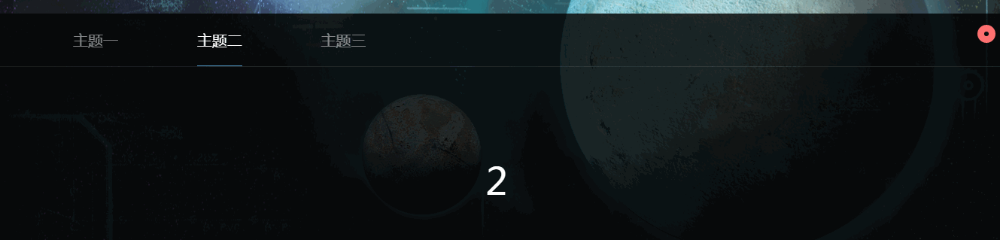

# myVueComponents

some vue components for PC & mobile

###for PC

- WeShow.vue

[live demo](https://wiia.github.io/myVueComponents/dist/)

```
<we-show :msg-list="msg_list"
         :show-style="curMsg.showStyle" 
         :show-speed="curMsg.showSpeed"
         :is-scroll="curMsg.isScroll"
         :if-poster="curMsg.ifPoster"
         :poster-content="curMsg.posterContent"></we-show>
```

- StarBg.vue

- PopBanner.vue

pure css tabs

```
<pop-banner :is-hidden.sync="popBanner_hidden"></pop-banner>
```



- LargerMsg.vue

```
<larger-msg :is-hidden.sync="largerMsg_hidden.is_hidden"
            :avatar="largerMsg_hidden.avatar"
			:user="largerMsg_hidden.user"
			:content="largerMsg_hidden.content"></larger-msg>
```

###for mobile

- AppHeader.vue


- LargerImg.vue

```
<larger-img :is-hidden.sync="largerImg_hidden"
                :index-cur.sync="larger_index"
                :img-list="post_img"></larger-img>
```

- SubmitBtn.vue

```
<submit-btn :url="url"
			:data="data"></submit-btn>
```


